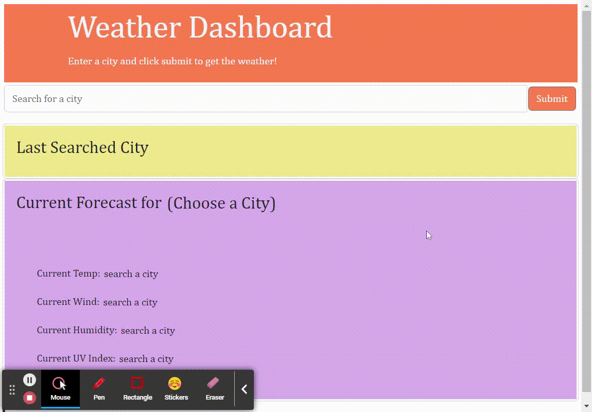

# Weather Dashboard

This app allows the user to enter a city and get the current weather for that city, plus a five day forecast. The UV index contains a box that changes color depending on whether the UV index is favorable, moderate, or severe.

The following .gif demonstrates the application functionality:

Here is the link to the deployed application:

https://lizranzim.github.io/WeatherDashboard/
